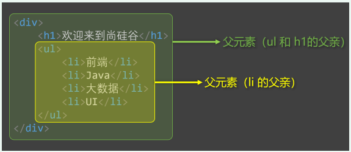
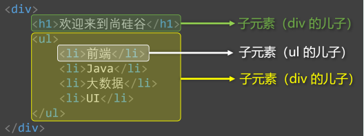
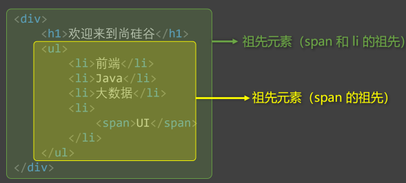
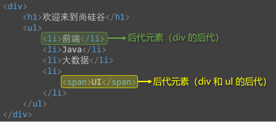
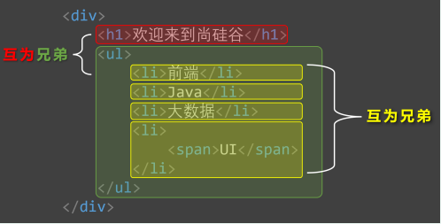

# css 语法

## css的编写位置

### 行内样式

- 写在标签的 `style` 属性中，(又称，内联样式).
- 语法: `<h1 style="color: red; font-size: 30px;">这是一行文本</h1>`;
- 注意点: 
    1. `style` 属性的值不能随便写，要符合 `CSS` 语法规范，是 `key:value;` 的形式;
    2. 行内样式，只能控制当前标签样式，对其它标签无效;

- 存在的问题:
    书写繁琐，样式不能复用，没有体现出 结构-样式分离 的思想，不推荐大量使用，只有对当前元素添加简单样式时，才偶尔使用;

### 内部样式

- 写在 `html` 页面内部，将所有的 `CSS` 代码提取出来，单独放在 `<style>` 标签中;
- 语法: 
    ```css
    <style>
        h1 {
            color: red;
            font-size: 40px;
        }
    </style>
    ```
- 注意点:
    1. `<style>` 标签理论上可以放在 `html` 文档的任何地方，但一般都放在 `<head>` 标签中;
    2. 此种写法: 代码可以复用，结构清晰;

- 存在的问题:
    1. 没有实现 结构-样式 的完全分离;
    2. 多个 `html` 页面无法复用样式;


### 外部样式

- 写在单独的 `.css` 文件中，随后在 `html` 文件中引入使用。
- 语法:
    1. 定义一个扩展名为 `.csss` 的样式文件，把所有的 `CSS` 代码都放在此文件中。
    ```css
    h1 {
        color: blue;
        font-size: 50px;
    }
    ```
    2. 在 `html` 中引入 `.css` 文件;
    ```html
    <link rel="stylesheet" href="./xxx.css" >
    ```

- 注意点
    1. `<link>` 标签要写在 `<head>` 标签中;
    2. `<link>` 标签属性说明:
        - `href`: 引入的 资源路径;
        - `rel` (`relation`: 关系):  说明引入的文档与当前文档之间的关系;
    3. 外部样式的优势: 样式可以复用，结构清晰，可触发浏览器的缓存机制，提高访问速度，实现了 结构与样式的完全分离;
    4. 实际开发中，几乎都是用外部样式，这是 最推荐的使用方式;


## 样式表的优先级

- 优先级规则: 行内样式 > 内部样式 = 外部样式;
    1. 内部样式、外部样式，这二者的优先级相同，且: 后面的 会覆盖 前面的;
    2. 同一个样式表中，优先级也和编写顺序有关，且: 后面的 会覆盖 前面的;

| 分类 | 优点 | 缺点 | 使用频率 | 作用范围 |
| --- | --- | --- | --- | --- |
| 行内样式 | 优先级最高 | 1.结构与样式未分离<br/>2.代码结构混乱<br/>3.样式不能复用 | 很低 | 当前标签 |
| 内部样式 | 1.样式可复用<br/>2.代码结构清晰 | 1.结构与样式未彻底分离<br/>2.样式不能多页面复用 | 一般 | 当前页面 |
| 外部样式 | 1.样式可多页面复用<br/>2.代码结构清晰<br/>3.可触发浏览器的缓存机制<br/>4.结构与样式彻底分离 | 需要引入才能使用 | 最高 | 多个页面 |


## CSS语法规范

`CSS` 语法由两部分组成:

- 选择器: 找到要添加样式的元素;
- 声明块: 设置具体的样式 (声明块 是由 一个或多个 声明 组成)，声明的格式为: `属性名: 属性值;`;

备注:
1. 最后一个声明后的分号理论上能省略，但最好还是写上;
2. 选择器与声明块之间，属性名与属性值之间，均有一个空格，理论上能省略，但最好还是加上;

- 注释的写法:
```css
/* 这是一行注释 */
h1 {
    /* 这是一行注释 */
    color: red; /* 这里也是注释 */
    font-size: 40px;
}
```

## CSS代码风格

- 展开风格 -- 开发时推荐，便于维护和调试
```css
h1 {
    color: red;
    font-size: 40px;
}
```
- 紧凑风格 -- 项目上线时推荐，可减小体积
```css
h1{color:red;font-size:40px;}
```

备注:
    项目上线时，我们会通过工具将 展开风格 的代码，变成 紧凑风格，这样可以减小文件体积，节约网络流量，同时也能让用户打开网页时速度更快;


## CSS选择器

### 基本选择器

基本选择器包括:

    1. 通配选择器;
    2. 元素选择器;
    3. 类选择器;
    4. id选择器;


| 基本选择器 | 特点 | 用法 |
| --- | --- | --- |
| 通配选择器 | 选中所有标签，一般用于清除样式 | `* { color: red;}` |
| 元素选择器 | 选中所有同种标签，但是不能差异化选择 | `h1 { color: red;}` |
| 类选择器 | 选中所有特定类名 (`class`值) 的元素，使用频率高 | `.demo { color: red;}` |
| id选择器 | 选中特定 `id` 值的那个元素（唯一的） | `#title { color: red; }` |

#### 1. 通配选择器

- 作用: 可以选中所有 `html` 元素;
- 语法: 
```css
* {
    属性名: 属性值;
}

/* 举例 */
* {
    /* 选中所有元素 */
    color: red;
    font-size: 40px;
}
```

备注: 目前来看，通配选择器貌似优点鸡肋，但后面清除样式时，会对我们有很大帮助;

#### 2. 元素选择器

- 作用: 为页面中 某种元素 统一设置样式;
- 语法:
```css
标签名 {
    属性名: 属性值;
}

/* 举例: 选中所有的 h1 标签 */
h1 {
    color: red;
    font-size: 40px;
}
```

备注: 元素选择器无法实现 差异化设置，例如：上面的代码中，所有 h1 元素效果都一样;

#### 3. 类选择器

- 作用: 根据元素的 `class` 值，来选中某些属性;

`class` 翻译过来有: 种类、类别的含义，所以 `class` 值，又称: 类名;

- 语法:
```css
.类名 {
    属性名: 属性值;
}

/* 举例 */

// 声明 class 的 style 样式
.demo {
    color: red;
}
.bg {
    background-color: aqua;
}
```

- 注意点:
    1. 元素的 `class` 属性值不带 `.` ,但 `css` 的类选择器要带 `.`;
    2. `class` 值，是我们自定义的，按照标准: 不要使用纯数字、不要使用中文、尽量使用英文和数字的组合，若由多个单词组成，使用 `-` 做链接，例如: `left-menu`, 最好是 见名知意;
    3. 一个元素不能写多个 `class` 属性，下面是错误示例:
    ```html
    <!-- 该写法错误，元素的属性不能重复，后写的会失效 -->
    <h1 class="demo" class="bg" >这是一行文本</h1>
    ```
    4. 一个元素的 `class` 属性，能写多个值，要用 空格 隔开:
    ```html
    <!-- 该写法正确，class 属性的属性值能写多个 -->
    <h1 class="demo bg" >这是一行文本</h1>
    ```

#### 4. id选择器

- 作用: 根据元素的 `id` 属性值，来精确的选中 某个 元素;
- 语法:
```css
#id值 {
    属性名: 属性值;
}

/* 举例: 选中 id 为 title 的元素 */
#title {
    color: red;
    font-size: 50px;
}
```

- 注意:
    1. `id` 属性值: 尽量由字母、数字、下划线 `_` 、短杠 `-` 组成，最好以字母开头，不要包含空格，区分大小写;
    2. 一个元素只能拥有一个 `id` 属性，多个元素的 `id` 属性值不能相同;
    3. 一个元素可以同时拥有 `id` 和 `class` 属性;

### 交集选择器

- 作用: 选中 同时符合 多个条件的元素 （ && ）;
- 语法: 
```css
选择器1选择器2...选择器n {
    属性名: 属性值;
}

/* 举例 */
.demo.bg {
    color: red;
    background-color: blue;
}
```

注意: 
    1. 有标签名时，标签名必须写在前面;
    2. `id` 选择器，理论上可以作为 交集的 条件，但实际应用中几乎不用；(没有意义)
    3. 交集选择器中 **不可能 出现 两个元素选择器**，因为一个元素，不可能既是 `p` 元素，又是 `span` 元素;
    4. 用的最多的交集选择器是: 元素选择器配合类名选择器 (`p.demo {...}`)，元素选择器必须写在第一个位置;

### 并集选择器

- 作用: 选中多个选择器对应的元素，又称: 分组选择器 ( || );
- 语法:
```css
选择器1,选择器2,...选择器n {
    属性名: 属性值;
}

/* 举例 */

#title
.demo1
.demo2 {
    background-color: red;
    font-size: 40px;
}
```

注意:
    1. 并集选择器一般 竖着写;
    2. 任何形式的选择器，都可以作为并集选择器的一部分;
    3. 并集选择器，通常用于 集体声明，可以缩小 样式表体积;


## HTML元素之间的关系

- 父元素: 直接包裹某个元素的元素，就是该元素的父元素;



- 子元素: 被父元素直接包裹的元素;



- 祖先元素: 父元素的父元素。。。，一直往外找，都是祖先元素;



- 后代元素: 子元素的子元素。。。，一直往里找，都是后代元素;



- 兄弟元素: 具有相同父元素的元素，都是兄弟元素;



## 后代选择器

- 作用: 选中指定元素中，符合要求的后代元素;
- 语法: 选择器之间使用 空格 隔开
```css
/* 先写祖先，再写后代 */
选择器1 选择器2 ... 选择器n {
    属性名: 属性值;
}

/* 举例 */
/* 选中 ul 中的所有 li */
ul li {
    color: red;
}

/* 选中 ul 中，所有 li 中的 a 元素 */
ul li a {
    color: red;
}

/* 选中类名为 demo 元素的所有 a 元素 */
.demo a {
    color: red;
}

/* 选中类名为 demo 元素下的，所有类名为 hello 的 a 元素 */
.demo a.hello {
    color: red;
}
```

注意:

1. 后代选择器，最终选选择的是后代，不选中祖先;
2. 儿子，孙子。。。都算后代; (即: 选中的不一定是直接子元素)
3. 结构一定要符合 `HTML` 嵌套要求，例如: 不能再 `p` 标签中写 `h1~h6`;

## 子代选择器

- 作用: 选中指定元素中，符合要求的 子元素; 
- 语法: 选择器之间使用 `>` 隔开
```css
选择器1 > 选择器2 > ... > 选择器n {
    属性名: 属性值;
}

/* 举例 */
/* 选中 div 中的子代 a 元素 */
div > a {
    color: red;
}

/* 选中类名为 demo 中的 子代 a 元素 */
.demo > a {
    color: red;
}
```

注意:

1. 子代选择器最终选择的是子代，不是父级;
2. 子代指的是直接子元素，子元素的子元素等，都不算;


## 兄弟选择器

### 相邻兄弟选择器

- 作用: 选中指定元素后，符合条件的 相邻兄弟 (**紧挨着的下一个**) 元素;
- 语法:
```css
选择器1 + 选择器2 {
    属性名: 属性值;
}

/* 选中div后相邻的兄弟元素 p */
div+p {
    color: red;
}
```

### 通用兄弟选择器

- 作用: 选中指定元素后，符合条件的 **后面所有兄弟** 元素;
- 语法:
```css
选择器1~选择器2 {
    属性名: 属性值;
}

/* 选中 div 元素之后的所有 p 元素 */
div~p {
    background-color: blue;
}
```

## 属性选择器

- 作用: 选择属性值符合一定要求的元素;
- 语法:
```css
1. [属性名] 选中具有某个属性的元素;
2. [属性名="值"] 选中包含某个属性，且属性值等于指定值的元素;
3. [属性名^="值"] 选中包含某个属性，且属性值以指定的值 开头 的元素;
4. [属性名$="值"] 选中包含某个属性，且属性值以指定的值 结尾 的元素;
5. [属性名*="值"] 选中包含某个属性，且属性值 包含 指定值的元素;

/* 举例 */
/* 选中 包含title 属性的元素 */
[title] {
    background-color: aqua;
}

/* 选中 包含title 属性 且 值以 a 开头的元素 */
[title^="a"] {
    color: red;
}

/* 选中 包含title 属性 且 值包含 a 的元素 */
[title*="a"] {
    color: red;
}
```

## 伪类选择器

- 作用: 选中特殊状态的元素;

### 1. 动态伪类

1. `:link` 超链接 **未被访问** 的状态;
2. `:visited` 超链接 **访问过** 的状态;
3. `:hover` 鼠标 **悬停** 在元素上的状态;
4. `:active` 鼠标 **激活** 的状态; (激活: 鼠标按下不松开)
5. `:focus` 获取 **焦点** 的状态;

注意点:
1. 书写顺序遵循: `link`、`visited`、`hover`、`active` 顺序;
2. 表单类元素才能使用 `focus` 伪类;

### 2. 结构伪类

> 常用的

1. `:first-child` 所有兄弟元素中的第一个;
2. `:last-child` 所有兄弟元素中的最后一个;
3. `:nth-child(n)` 所有兄弟元素中的第n个;
4. `:first-of-type` 所有 **同类型** 兄弟元素中的第一个;
5. `:last-of-type` 所有 **同类型** 兄弟元素中的最后一个;
6. `:nth-of-type(n)` 所有 **同类型** 兄弟元素中的第n个;

关于 `n` 的取值:
1. 0 或 不写 ：什么都选不中 —— 几乎不用。
2. n ：选中所有子元素 —— 几乎不用。
3. 1~正无穷的整数 ：选中对应序号的子元素。
4. 2n 或 even ：选中序号为偶数的子元素。
5. 2n+1 或 odd ：选中序号为奇数的子元素。
6. -n+3 ：选中的是前 3 个

> 需要了解的

1. `:nth-last-child(n)` 所有兄弟元素中的倒数第 n 个。
2. `:nth-last-of-type(n)` 所有同类型兄弟元素中的 倒数第n个 。
3. `:only-child` 选择没有兄弟的元素（独生子女）。
4. `:only-of-type` 选择没有同类型兄弟的元素。
5. `:root` 根元素。
6. `:empty` 内容为空元素（空格也算内容）。
