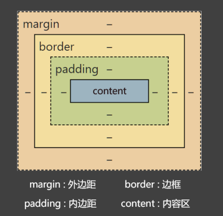

# css 语法

## css的编写位置

### 行内样式

- 写在标签的 `style` 属性中，(又称，内联样式).
- 语法: `<h1 style="color: red; font-size: 30px;">这是一行文本</h1>`;
- 注意点: 
    1. `style` 属性的值不能随便写，要符合 `CSS` 语法规范，是 `key:value;` 的形式;
    2. 行内样式，只能控制当前标签样式，对其它标签无效;

- 存在的问题:
    书写繁琐，样式不能复用，没有体现出 结构-样式分离 的思想，不推荐大量使用，只有对当前元素添加简单样式时，才偶尔使用;

### 内部样式

- 写在 `html` 页面内部，将所有的 `CSS` 代码提取出来，单独放在 `<style>` 标签中;
- 语法: 
    ```css
    <style>
        h1 {
            color: red;
            font-size: 40px;
        }
    </style>
    ```
- 注意点:
    1. `<style>` 标签理论上可以放在 `html` 文档的任何地方，但一般都放在 `<head>` 标签中;
    2. 此种写法: 代码可以复用，结构清晰;

- 存在的问题:
    1. 没有实现 结构-样式 的完全分离;
    2. 多个 `html` 页面无法复用样式;


### 外部样式

- 写在单独的 `.css` 文件中，随后在 `html` 文件中引入使用。
- 语法:
    1. 定义一个扩展名为 `.csss` 的样式文件，把所有的 `CSS` 代码都放在此文件中。
    ```css
    h1 {
        color: blue;
        font-size: 50px;
    }
    ```
    2. 在 `html` 中引入 `.css` 文件;
    ```html
    <link rel="stylesheet" href="./xxx.css" >
    ```

- 注意点
    1. `<link>` 标签要写在 `<head>` 标签中;
    2. `<link>` 标签属性说明:
        - `href`: 引入的 资源路径;
        - `rel` (`relation`: 关系):  说明引入的文档与当前文档之间的关系;
    3. 外部样式的优势: 样式可以复用，结构清晰，可触发浏览器的缓存机制，提高访问速度，实现了 结构与样式的完全分离;
    4. 实际开发中，几乎都是用外部样式，这是 最推荐的使用方式;


## 样式表的优先级

- 优先级规则: 行内样式 > 内部样式 = 外部样式;
    1. 内部样式、外部样式，这二者的优先级相同，且: 后面的 会覆盖 前面的;
    2. 同一个样式表中，优先级也和编写顺序有关，且: 后面的 会覆盖 前面的;

| 分类 | 优点 | 缺点 | 使用频率 | 作用范围 |
| --- | --- | --- | --- | --- |
| 行内样式 | 优先级最高 | 1.结构与样式未分离<br/>2.代码结构混乱<br/>3.样式不能复用 | 很低 | 当前标签 |
| 内部样式 | 1.样式可复用<br/>2.代码结构清晰 | 1.结构与样式未彻底分离<br/>2.样式不能多页面复用 | 一般 | 当前页面 |
| 外部样式 | 1.样式可多页面复用<br/>2.代码结构清晰<br/>3.可触发浏览器的缓存机制<br/>4.结构与样式彻底分离 | 需要引入才能使用 | 最高 | 多个页面 |


## CSS语法规范

`CSS` 语法由两部分组成:

- 选择器: 找到要添加样式的元素;
- 声明块: 设置具体的样式 (声明块 是由 一个或多个 声明 组成)，声明的格式为: `属性名: 属性值;`;

备注:
1. 最后一个声明后的分号理论上能省略，但最好还是写上;
2. 选择器与声明块之间，属性名与属性值之间，均有一个空格，理论上能省略，但最好还是加上;

- 注释的写法:
```css
/* 这是一行注释 */
h1 {
    /* 这是一行注释 */
    color: red; /* 这里也是注释 */
    font-size: 40px;
}
```

## CSS代码风格

- 展开风格 -- 开发时推荐，便于维护和调试
```css
h1 {
    color: red;
    font-size: 40px;
}
```
- 紧凑风格 -- 项目上线时推荐，可减小体积
```css
h1{color:red;font-size:40px;}
```

备注:
    项目上线时，我们会通过工具将 展开风格 的代码，变成 紧凑风格，这样可以减小文件体积，节约网络流量，同时也能让用户打开网页时速度更快;


## CSS选择器

### 基本选择器

基本选择器包括:

    1. 通配选择器;
    2. 元素选择器;
    3. 类选择器;
    4. id选择器;


| 基本选择器 | 特点 | 用法 |
| --- | --- | --- |
| 通配选择器 | 选中所有标签，一般用于清除样式 | `* { color: red;}` |
| 元素选择器 | 选中所有同种标签，但是不能差异化选择 | `h1 { color: red;}` |
| 类选择器 | 选中所有特定类名 (`class`值) 的元素，使用频率高 | `.demo { color: red;}` |
| id选择器 | 选中特定 `id` 值的那个元素（唯一的） | `#title { color: red; }` |

#### 1. 通配选择器

- 作用: 可以选中所有 `html` 元素;
- 语法: 
```css
* {
    属性名: 属性值;
}

/* 举例 */
* {
    /* 选中所有元素 */
    color: red;
    font-size: 40px;
}
```

备注: 目前来看，通配选择器貌似优点鸡肋，但后面清除样式时，会对我们有很大帮助;

#### 2. 元素选择器

- 作用: 为页面中 某种元素 统一设置样式;
- 语法:
```css
标签名 {
    属性名: 属性值;
}

/* 举例: 选中所有的 h1 标签 */
h1 {
    color: red;
    font-size: 40px;
}
```

备注: 元素选择器无法实现 差异化设置，例如：上面的代码中，所有 h1 元素效果都一样;

#### 3. 类选择器

- 作用: 根据元素的 `class` 值，来选中某些属性;

`class` 翻译过来有: 种类、类别的含义，所以 `class` 值，又称: 类名;

- 语法:
```css
.类名 {
    属性名: 属性值;
}

/* 举例 */

// 声明 class 的 style 样式
.demo {
    color: red;
}
.bg {
    background-color: aqua;
}
```

- 注意点:
    1. 元素的 `class` 属性值不带 `.` ,但 `css` 的类选择器要带 `.`;
    2. `class` 值，是我们自定义的，按照标准: 不要使用纯数字、不要使用中文、尽量使用英文和数字的组合，若由多个单词组成，使用 `-` 做链接，例如: `left-menu`, 最好是 见名知意;
    3. 一个元素不能写多个 `class` 属性，下面是错误示例:
    ```html
    <!-- 该写法错误，元素的属性不能重复，后写的会失效 -->
    <h1 class="demo" class="bg" >这是一行文本</h1>
    ```
    4. 一个元素的 `class` 属性，能写多个值，要用 空格 隔开:
    ```html
    <!-- 该写法正确，class 属性的属性值能写多个 -->
    <h1 class="demo bg" >这是一行文本</h1>
    ```

#### 4. id选择器

- 作用: 根据元素的 `id` 属性值，来精确的选中 某个 元素;
- 语法:
```css
#id值 {
    属性名: 属性值;
}

/* 举例: 选中 id 为 title 的元素 */
#title {
    color: red;
    font-size: 50px;
}
```

- 注意:
    1. `id` 属性值: 尽量由字母、数字、下划线 `_` 、短杠 `-` 组成，最好以字母开头，不要包含空格，区分大小写;
    2. 一个元素只能拥有一个 `id` 属性，多个元素的 `id` 属性值不能相同;
    3. 一个元素可以同时拥有 `id` 和 `class` 属性;

### 交集选择器

- 作用: 选中 同时符合 多个条件的元素 （ && ）;
- 语法: 
```css
选择器1选择器2...选择器n {
    属性名: 属性值;
}

/* 举例 */
.demo.bg {
    color: red;
    background-color: blue;
}
```

注意: 
    1. 有标签名时，标签名必须写在前面;
    2. `id` 选择器，理论上可以作为 交集的 条件，但实际应用中几乎不用；(没有意义)
    3. 交集选择器中 **不可能 出现 两个元素选择器**，因为一个元素，不可能既是 `p` 元素，又是 `span` 元素;
    4. 用的最多的交集选择器是: 元素选择器配合类名选择器 (`p.demo {...}`)，元素选择器必须写在第一个位置;

### 并集选择器

- 作用: 选中多个选择器对应的元素，又称: 分组选择器 ( || );
- 语法:
```css
选择器1,选择器2,...选择器n {
    属性名: 属性值;
}

/* 举例 */

#title
.demo1
.demo2 {
    background-color: red;
    font-size: 40px;
}
```

注意:
    1. 并集选择器一般 竖着写;
    2. 任何形式的选择器，都可以作为并集选择器的一部分;
    3. 并集选择器，通常用于 集体声明，可以缩小 样式表体积;


## HTML元素之间的关系

- 父元素: 直接包裹某个元素的元素，就是该元素的父元素;


- 子元素: 被父元素直接包裹的元素;


- 祖先元素: 父元素的父元素。。。，一直往外找，都是祖先元素;


- 后代元素: 子元素的子元素。。。，一直往里找，都是后代元素;


- 兄弟元素: 具有相同父元素的元素，都是兄弟元素;


## 后代选择器

- 作用: 选中指定元素中，符合要求的后代元素;
- 语法: 选择器之间使用 空格 隔开
```css
/* 先写祖先，再写后代 */
选择器1 选择器2 ... 选择器n {
    属性名: 属性值;
}

/* 举例 */
/* 选中 ul 中的所有 li */
ul li {
    color: red;
}

/* 选中 ul 中，所有 li 中的 a 元素 */
ul li a {
    color: red;
}

/* 选中类名为 demo 元素的所有 a 元素 */
.demo a {
    color: red;
}

/* 选中类名为 demo 元素下的，所有类名为 hello 的 a 元素 */
.demo a.hello {
    color: red;
}
```

注意:

1. 后代选择器，最终选选择的是后代，不选中祖先;
2. 儿子，孙子。。。都算后代; (即: 选中的不一定是直接子元素)
3. 结构一定要符合 `HTML` 嵌套要求，例如: 不能再 `p` 标签中写 `h1~h6`;

## 子代选择器

- 作用: 选中指定元素中，符合要求的 子元素; 
- 语法: 选择器之间使用 `>` 隔开
```css
选择器1 > 选择器2 > ... > 选择器n {
    属性名: 属性值;
}

/* 举例 */
/* 选中 div 中的子代 a 元素 */
div > a {
    color: red;
}

/* 选中类名为 demo 中的 子代 a 元素 */
.demo > a {
    color: red;
}
```

注意:

1. 子代选择器最终选择的是子代，不是父级;
2. 子代指的是直接子元素，子元素的子元素等，都不算;


## 兄弟选择器

### 相邻兄弟选择器

- 作用: 选中指定元素后，符合条件的 相邻兄弟 (**紧挨着的下一个**) 元素;
- 语法:
```css
选择器1 + 选择器2 {
    属性名: 属性值;
}

/* 选中div后相邻的兄弟元素 p */
div+p {
    color: red;
}
```

### 通用兄弟选择器

- 作用: 选中指定元素后，符合条件的 **后面所有兄弟** 元素;
- 语法:
```css
选择器1~选择器2 {
    属性名: 属性值;
}

/* 选中 div 元素之后的所有 p 元素 */
div~p {
    background-color: blue;
}
```

## 属性选择器

- 作用: 选择属性值符合一定要求的元素;
- 语法:
```css
1. [属性名] 选中具有某个属性的元素;
2. [属性名="值"] 选中包含某个属性，且属性值等于指定值的元素;
3. [属性名^="值"] 选中包含某个属性，且属性值以指定的值 开头 的元素;
4. [属性名$="值"] 选中包含某个属性，且属性值以指定的值 结尾 的元素;
5. [属性名*="值"] 选中包含某个属性，且属性值 包含 指定值的元素;

/* 举例 */
/* 选中 包含title 属性的元素 */
[title] {
    background-color: aqua;
}

/* 选中 包含title 属性 且 值以 a 开头的元素 */
[title^="a"] {
    color: red;
}

/* 选中 包含title 属性 且 值包含 a 的元素 */
[title*="a"] {
    color: red;
}
```

## 伪类选择器

- 作用: 选中特殊状态的元素;

### 1. 动态伪类

1. `:link` 超链接 **未被访问** 的状态;
2. `:visited` 超链接 **访问过** 的状态;
3. `:hover` 鼠标 **悬停** 在元素上的状态;
4. `:active` 鼠标 **激活** 的状态; (激活: 鼠标按下不松开)
5. `:focus` 获取 **焦点** 的状态;

注意点:
1. 书写顺序遵循: `link`、`visited`、`hover`、`active` 顺序;
2. 表单类元素才能使用 `focus` 伪类;

### 2. 结构伪类

> 常用的

1. `:first-child` 所有兄弟元素中的第一个;
2. `:last-child` 所有兄弟元素中的最后一个;
3. `:nth-child(n)` 所有兄弟元素中的第n个;
4. `:first-of-type` 所有 **同类型** 兄弟元素中的第一个;
5. `:last-of-type` 所有 **同类型** 兄弟元素中的最后一个;
6. `:nth-of-type(n)` 所有 **同类型** 兄弟元素中的第n个;

关于 `n` 的取值:
1. 0 或 不写 ：什么都选不中 —— 几乎不用。
2. n ：选中所有子元素 —— 几乎不用。
3. 1~正无穷的整数 ：选中对应序号的子元素。
4. 2n 或 even ：选中序号为偶数的子元素。
5. 2n+1 或 odd ：选中序号为奇数的子元素。
6. -n+3 ：选中的是前 3 个

> 需要了解的

1. `:nth-last-child(n)` 所有兄弟元素中的倒数第 n 个。
2. `:nth-last-of-type(n)` 所有同类型兄弟元素中的 倒数第n个 。
3. `:only-child` 选择没有兄弟的元素（独生子女）。
4. `:only-of-type` 选择没有同类型兄弟的元素。
5. `:root` 根元素。
6. `:empty` 内容为空元素（空格也算内容）。


### 3. 否定伪类选择器

`:not(选择器)` 排除满足括号中条件的元素;


### 4. UI伪类

1. `:checked` 被选中的 复选框 或 单选 按钮;
2. `:enable` 可用的表单元素 ( 没有 `disabled` 属性);
3. `:disabled` 不可用的表单元素 ( 有 `disabled` 属性);


### 5. 目标伪类

`:target` 选中锚点指向的元素;

### 6. 语言伪类

`:lang()` 根据指定语言选择元素 （本质: 看 `lang` 属性的值）;

## 伪元素选择器

- 作用: 选中元素中的一些特殊位置;

> 常用伪元素

1. `::first-letter` 选中元素中的第一个文字。
2. `::first-line` 选中元素中的第一行文字。
3. `::selection` 选中被鼠标选中的内容。
4. `::placeholder` 选中输入框的提示文字。
5. `::before` 在元素最开始的位置，创建一个子元素（必须用 content 属性指定内容）。
6. `::after` 在元素最后的位置，创建一个子元素（必须用 content 属性指定内容）。


## 选择器的优先级

通过 不同的选择器 ，选中 相同的元素，并且为 相同的样式名 设置不同的值时，就发生了样式冲突。

简单的优先级如下:
`行内样式 > ID选择器 > 类选择器 > 元素选择器 > 通配选择器`;

详细规则如下:

1. 计算方式: 每个选择器都可以计算出一组权重，格式为 (a, b, c)
    - a: ID选择器的个数
    - b: 类、伪类、属性选择器的个数;
    - c: 元素、伪元素选择器的个数;

|选择器|权重|
| -- | -- |
| `ul>li` | `(0, 0, 2)` |
| `div ul>li p a span` | `(0, 0, 6)` |
| `#atguigu .slogan` | `(1, 1, 0)` |
| `#atguigu .slogan a` | `(1, 1, 1)` |
| `#atguigu .slogan a:hover` | `(1, 2, 1)` |

2. 比较规则: 按照 从左到右 的顺序，依次比较大小，当前 位 胜出后，后面的不再比较。

    - `(1, 0, 0)` > `(0, 2, 2)`
    - `(1, 1, 0)` > `(1, 0, 3)`
    - `(1, 1, 3)` > `(1, 1, 2)`

3. 特殊规则

    - 行内样式权重大于所有选择器;
    - `!important` 的权重，大于行内样式，大于所有选择器，权重最高;


# CSS三大特性

1. 层叠性

- 概念: 如果发生了样式冲突，那就会根据一定的规则（选择器优先级），进行样式层叠（覆盖）; 

什么是冲突: 元素的同一个样式名，被设置了不同值;

2. 继承性

- 概念: 元素会自动拥有 父元素 、或其 祖先元素 上所设置的 **某些样式**;
- 规则: 优先继承 离得近 的;
- 常见的可继承属性: `text-xxx`、`font-xxx`、`line-xxx`、`color`...; 

备注: 可以参考 `MDN` 网站 (https://developer.mozilla.org/zh-CN/)查询属性是否可以被继承;

3. 优先级
- 简单聊: `!important` > 行内样式 > ID选择器 > 类选择器 > 元素选择器 > * (通配符选择器) > 继承的样式;
- 详细聊: 需要计算权重;

注意: 并集选择器的每个部分是分开算的;

# CSS常用属性


## 1. 像素

- 概念: 电脑屏幕是由一个一个 "小点" 组成，每个小点就是一个 像素(px);
- 规律: 像素点越小，呈现的内容越清晰、越细腻;

## 颜色

### 方式一: 颜色名

编写方式: 直接使用颜色对应的英文单词，编写比较简单
```css
红色: red
绿色: green
蓝色: blue
```

颜色名这种方式，表达颜色比较单一，用的不多;

具体可以参考: https://developer.mozilla.org/en-US/docs/Web/CSS/named-color

### 方式二: `rgb` 或 `rgba`

编写方式: 使用 `红 (r)`、`绿 (g)`、`蓝 (b)`、`透明度 (a)`;
```css
/* 使用 0-255 之间的数字表示一种颜色 */
color: rgb(255, 0, 0)   // 红色
color: rgb(0, 255, 0)   // 绿色
color: rgb(0, 0, 255)   // 蓝色

/* 半透明红色 */
color: rgba(255, 0, 0, 0.5)

/* 使用 百分比 表示一种颜色 （用的少）*/
color: rgb(100%, 0%, 0%)
color: rgba(100%, 0%, 0%, 50%)
```

小规律:
1. 若三种颜色值相同，呈现的是灰色，值越大，灰色越浅;
2. `rgb(0, 0, 0)` 是黑色，`rgb(255, 255, 255)` 是白色;
3. 对于 `rgba` 来说，前三位的 `rgb` 形式要保持一致，要么都是 `0-255` 的数字，要么都是百分比;


### 方式三: `HEX` 或 `HEXA`

`HEX` 的原理与 `rgb` 一样，依然是通过 `红绿蓝` 进行组合，只不过要用六位 （分成三组）来表达;

格式为: `#rrggbbaa`, 每一位的取值范围为: `00-FF`

```css
color: #FF0000  // 红色
color: #F00 // 红色简写
color: #FF0000BB    // 加上透明度
```

注意: IE浏览器不支持 `HEXA`，但支持 `HEX`;


## CSS字体属性

## 1. 字体大小

- 属性名: `font-size`

```css
div {
    font-size: 40px;
}
```

注意点:

1. `chrome` 浏览器支持的最小文字为 `12px`，默认的文本大小为 `16px`, 字体大小设置为 `0px` 会自动消失;
2. 不同的浏览器默认的字体大小可能不一样，所以最好给一个明确的值，不要用浏览器的默认大小(不设置 `font-size` 就会使用默认值);
3. 通常以给 `body` 设置 `font-size` 属性，这样 `body` 中的其它元素就都可以继承了;

## 2. 字体族

- 属性名: `font-family`

```css
div {
    font-family: "STcaiyun", "微软雅黑";
}
```

注意:

1. 使用字体的英文名字兼容性会更好，具体的英文名可以自己查询（电脑的 设置 里面可以查找）;
2. 如果字体名字包含 空格，必须使用 引号 ("") 包裹起来;
3. 可以设置多个字体，按照 从左往右 的顺序挨个匹配，匹配上就用，没有匹配就继续向后寻找，且通常在最后写上 `serif` (衬线字体) 或 `sans-serif` (非衬线字体);
4. `windows` 系统中，默认的字体就是 微软雅黑;

## 3. 字体风格

- 属性名: `font-style`
- 作用: 控制字体是否为斜体;

```css
/*
常用值:
1. normal: 正常 (默认)
2. italic: 斜体 (使用字体自带的斜体效果)    // 推荐的斜体实现方式
3. oblique: 斜体 (强制倾斜产生的斜体效果)
*/

div {
    font-style: italic;
}
```

## 4. 字体粗细

- 属性名: `font-weight`
- 作用: 控制字体粗细


- 常用关键词
    1. `lighter`: 细
    2. `normal`: 正常
    3. `bold`: 粗
    4. `bolder`: 很粗 (多数字体不支持)

- 常用数值
    1. `100 - 1000` 且无单位，数值越大字体越粗;
    2. `100 - 300` 等同于 `lighter`, `400 - 500` 等同于 `normal`, `600`及以上等同于 `bold`;

```css
div {
    font-weight: bold;
}
p {
    font-weight: 600;
}
```

## 5.字体复合写法

可以把上述字体样式合并成一个属性，复合在一起编写

- 属性名: `font`
- 编写规则:
    1. 字体大小、字体族必须都写上;
    2. 字体族必须是最后一位，字体大小必须是倒数第二位;
    3. 多个属性值之间使用 空格 隔开;

备注: 实际开发中，推荐使用符合写法，但也不是绝对的，例如只想设置字体大小，你就直接使用 `font-size` 属性;

# CSS文本属性

## 1. 文本颜色

- 属性名: `color`
- 可选值:
    1. 颜色名
    2. `rgb` 或 `rgba`  // 推荐
    3. `HEX` 或 `HEXA` （十六进制） // 推荐
    4. `HSL` 或 `HSLA`

```css
color: #FF0000;
```

## 2. 文本间距

- 属性名:
    1. 字母间距: `letter-spacing`
    2. 单词间距: `word-spacing` （通过 空格 识别词）

属性值为像素(px)，正值让间距增大，负值让间距缩小;

```css
div {
    letter-spacing: 10px;
    word-spacing: 10px;
}
```

## 3. 文本修饰

- 属性名: `text-decoration`
- 作用: 控制文本的各种装饰线;

- 可选值:
    1. `none`: 无装饰线 （常用）
    2. `underline`: 下划线 (常用)
    3. `overline`: 上划线
    4. `line-through`: 删除线

- 可搭配如下值使用:
    1. `dotted`: 虚线
    2. `wavy`: 波浪线
    3. 也可指定颜色

```css
p {
    text-decoration: underline;
    text-decoration: underline dotted;
    text-decoration: underline dotted red;
}
```

## 4. 文本缩进

- 属性名: `text-indent`
- 作用: 控制文本首字母的缩进;
- 属性值: css 中的长度单位;

```css
div {
    /* 缩进两个字符 */
    text-indent: 2em;
    /* 缩进20个像素 */
    text-indent: 20px;
}
```

## 5. 文本对齐 (水平)

- 属性名: `text-align`
- 作用: 控制文本水平对齐的方式;
- 常用值:
    - `left`: 左对齐 (默认值)
    - `right`: 右对齐
    - `center`: 剧中对齐

```css
div {
    text-align: left;
    text-align: right;
    text-align: center;
}
```

## 6. 细说 `font-size`

1. 由于字体设置原因，文字最终呈现的大小，并不一定与 `font-size` 的值一致，可能大，也可能小;
例如: `font-size` 设置为 `40px`，最终呈现的文字，可能比 `40px` 大，也可能比 `40px` 小;

2. 通常情况下，文字相对字体设计框，并不是垂直居中的，通常都靠下一些;

## 7. 行高

- 属性名: `line-height`
- 作用: 控制一行文字的高度;
- 可选值:
    1. `normal`: 由浏览器根据文字大小决定的一个默认值;
    2. 像素: px;
    3. 数字: 参考自身的 `font-size` 的倍数 (常用);
    4. 百分比: 参考自身 `font-size` 的百分比;

备注: 由于字体设计的原因，文字在一行中，并不是绝对垂直居中，若一行中都是文字，不太会影响观感;

```css
div {
    line-height: 100px;
    line-height: 150%;
    line-height: 1.5;
}
```

注意:
1. `line-height` 过小会怎么样? -- 文字产生重叠，且最小值是 0, 不能为复数;
2. `line-height` 是可以继承的，且为了能更好的呈现文字，最好写数值;
3. `line-height` 和 `height` 是什么关系;
    - 设置了 `height` 那么高度就是 `height` 值;
    - 不设置 `height` 的时候，会根据 `line-height` 计算高度;

- 应用场景
1. 对于多行文字: 控制行与行之间的距离;
2. 对于单行文字: 让 `height` 等于 `line-height`，可以实现文字垂直居中;

备注: 由于字体设计原因，靠上述办法实现的居中，并不是绝对的垂直居中，如果一行中都是文字，不会太影响观感;

## 8. 文本对齐 (垂直)

1. 顶部: 无需任何属性，在垂直方向上，默认就是顶部对齐;
2. 居中: 对于单行文字，让 `height = line-height` 即可; (只能实现单行文本的垂直对齐，多行文本可以使用定位实现)
3. 底部: 对于单行文字，目前一个临时方案:
    - 让 `line-height = (height * 2) - font-size - x`; （`x` 是根据字体族动态决定的一个值;）

## 9. vertical-align

- 属性名: `vertical-align`
- 作用: 用于指定 **同一行元素之间**， 或 **表格单元格** 内的文字的 **垂直对齐方式**;
- 常用值:
    1. `baseline` (默认): 使用元素的 基线 与父元素的基线对齐;
    2. `top`: 使用元素的 顶部与其所在行的顶部对齐;
    3. `middle`: 使用元素的中部与父元素的基线加上父元素字母 `x` 的一半对齐;
    4. `bottom`: 使用元素的 底部与其所在行的底部对齐;

注意: `vertical-align` 不能控制块元素;

# CSS 列表属性

列表相关属性可以作用在 `ul`、`ol`、`li` 元素上;

| CSS属性名 | 功能 | 属性值 |
| -- | -- | -- |
| `list-style-type` | 设置列表符号 | 常用值如下:<br/> `none`: 不显示前面的标识(常用)<br/>`square`: 实心方块 <br/> `disc`: 圆形 <br/> `decimal`: 数字 <br/> `lower-roman`: 小写罗马数字 <br/> `upper-roman`: 大写罗马数字 <br/> `lower-alpha`: 小写字母 <br/> `upper-alpha`: 大写字母|
| `list-style-position` | 设置列表符号的位置 | `inside`: 在 `li` 的里面 <br/> `outside`: 在 `li` 外面 <br/> 这里可以通过给 `li` 设置背景查看差异 |
| `list-style-image` | 自定义列表符号 | `url(图片地址)` |
| `list-style` | 复合属性 | 上述属性值都可以，没有数量和顺序的要求 |

# CSS 表格属性

## 1. 边框相关属性 （其它元素也能使用）

| CSS属性名 | 功能 | 属性值 |
| -- | -- | -- |
| `border-width` | 边框宽度 | CSS中可用的长度值 |
| `border-color` | 边框颜色 | CSS中可用的颜色值 |
| `border-style` | 边框风格 | `none`: 默认值 <br/> `solid`: 实线 <br/> `dashed`: 虚线 <br/> `dotted`: 点线 <br/> `double`: 双实线|
| `border` | 边框复合属性 | 上述属性值都可以，没有数量和顺序的要求 |

注意: 以上 四个 边框相关的属性，其它元素也可以使用;

## 2. 表格独有属性 (只有 `table` 标签可以使用)

| CSS属性名 | 功能 | 属性值 |
| -- | -- | -- |
| `table-layout` | 设置列宽度 | `auto`: 自动，列宽根据内容计算(默认值) <br/> `fixed`: 固定列宽(可用于平分) |
| `border-spacing` | 单元格间距 | CSS中可用的长度值; <br/> 生效的前提是: 单元格边框不能合并 |
| `border-collapse` | 合并单元格边框 | `collapse`: 合并 <br/> `separate`: 不合并 |
| `empty-cells` | 隐藏没有内容的单元格 | `show`: 显示 (默认) <br/> `hide`: 隐藏 <br/> 生效的前提是: 单元格不能合并 |
| `caption-side` | 设置表格标题位置 | `top`: 上方 (默认) <br/> `bottom`: 在表格下方 |

# CSS背景属性

| CSS属性名 | 功能 | 属性值 |
| -- | -- | -- |
| `background-color` | 设置背景颜色 | 符合 CSS 中颜色规范的值 <br/> 默认背景颜色是: `transparent`|
| `background-image` | 设置背景图片 | `url(图片的地址)` |
| `background-repeat` | 设置背景重复的方式 | `repeat`: 重复 && 铺满整个元素 (默认) <br/> `repeat-x`: 只有在水平方向上重复 <br/> `repeat-y`: 只有在垂直方向上重复 <br/> `no-repeat`: 不重复 |
| `background-position` | 设置背景图位置 | **通过关键字设置位置** <br/> 写两个值，用空格隔开 <br/> - 水平: `left`、`center`、`right` <br/> - 垂直: `top`、`center`、`bottom` <br/> - 如果只写一个值，另一个方向的值为: `center` <br/>  <br/> **通过长度指定坐标位置** <br/> 以元素左上角，为坐标原点，设置图片左上角的位置 <br/> - 两个值分别是 `x` 坐标和 `y` 坐标 <br/> - 只写一个值，会被当做 `x` 坐标，`y` 坐标取 `center` |
||||

# CSS鼠标属性

| CSS属性名 | 功能 | 属性值 |
| -- | -- | -- |
| `cursor` | 设置鼠标光标的样式 | `pointer`: 小手 <br/> `move`: 移动图标 <br/> `text`: 文字选择器 <br/> `crosshair`: 十字架 <br/> `wait`: 等待 <br/> `help`: 帮助 |

> 自定义鼠标图标: `cursor: url("./arrow.png").pointer`


# CSS盒子模型

## 1. CSS长度单位

1. `px`: 像素
2. `em`: 相对元素 `font-size` 的倍数;
3. `rem`: 相对根字体大小，`html` 标签就是根;
4. `%`: 相对父元素计算

注意: CSS中设置长度，必须加单位，否则样式无效;


## 2. 元素的显示模式

- 块元素 (block)
    又称 块级元素，特点如下:
    1. 在页面中 独占一行，不会与任何元素共用一行，是从上到下排列;
    2. 默认宽度: 撑满父元素
    3. 默认高度: 由 内容 撑开
    4. 可以通过 CSS 设置宽高;

- 行内元素 (inline)
    又称 内联元素，特点如下:
    1. 在页面中 不独占一行，一行中不能容纳下的行内元素，会在下一行继续从左到右排列;
    2. 默认宽度: 由 内容撑开;
    3. 默认高度: 由 内容撑开;
    4. 无法通过 CSS 设置高度;

- 行内块元素 (inline-block)
    又称 内联块元素，特点如下:
    1. 在页面中 不独占一行，一行中不能容下的行内块元素，会在下一行继续从左到右排列;
    2. 默认宽度: 由 内容撑开;
    3. 默认高度: 由 内容撑开;
    4. 可以通过 CSS 设置宽高;

注意: 元素早期只分为: 行内元素、块级元素，区分条件也只有一条 是否独占一行，如果按照这个规则来分，那么 行内块元素应该算所行内元素;

## 3. 总结各元素的显示模式

| 显示模式 | 元素 |
| -- | -- |
| 块元素 (`block`) | 1. 主体结构标签: `<html>`、`<body>` <br/> 2. 排版标签: `<h1>~<h6>`、`<hr>`、`<p>`、`<pre>`、`<div>` <br/> 3. 列表标签: `<ul>`、`<ol>`、`<li>`、`<dl>`、`<dt>`、`<dd>` <br/> 4. 表格相关标签: `<table>`、`<tbody>`、`<thead>`、`<tfoot>`、`<tr>`、`<caption>` <br/> 5. `<form>` 与 `option` |
| 行内元素 (`inline`) | 1. 文本标签: `<br>`、`<em>`、`<strong>`、`<sup>`、`<sub>`、`<del>`、`<ins>` <br/> 2. `<a>` 与 `<lable>` |
| 行内块元素 (`inline-block`) | 1. 图片: `` <br/> 2. 单元格: `<td>`、`<th>` <br/> 3. 表单控件: `<input>`、`<textarea>`、`<select>`、`<button>` <br/> 4. 框架标签: `<iframe>` |

## 4. 修改元素的显示模式

通过 CSS 中的 `display` 属性可以修改元素的默认显示模式，常用值如下:

| 值 | 描述 |
| -- | -- |
| `none` | 元素会被 **隐藏** |
| `block` | 元素将作为 **块级元素显示** |
| `inline` | 元素将作为 **行内元素显示** |
| `inline-block` | 元素将作为 **行内块元素显示** |


## 5. 盒子模型的组成

`CSS` 会把所有的 `HTML` 元素都看成一个盒子，所有的样式也都是基于这个盒子;

1. `margin` (外边距): 盒子与外界的距离;
2. `border` (边框): 盒子的边框;
3. `padding` (内边距): 紧贴内容的补白区域;
4. `content` (内容): 元素中的文本或后代元素都是他的内容;



> 盒子的大小 = content + 左右 padding + 左右 border

注意: 外边距 (`margin`) 不会影响盒子的大小，但是会影响盒子的位置;

## 6. 盒子内容区 (`content`)

| `CSS`属性名 | 功能 | 属性值 |
| -- | -- | -- |
| `width` | 设置内容区域宽度 | 长度 |
| `max-width` | 设置内容区域的 **最大宽度** | 长度 |
| `min-width` | 设置内容区域的 **最小宽度** | 长度 |
| `height` | 设置内容区域的高度 | 长度 |
| `max-height` | 设置内容区域的 **最大高度** | 长度 |
| `min-height` | 设置内容区域的 **最小高度** | 长度 |


注意: 
1. `max-width`、`min-width` 一般不与 `width` 一起使用;
2. `max-height`、`min-height` 一般不与 `height` 一起使用;


## 7. 默认宽度

所谓 默认宽度，就是不设置 `width` 属性时，元素所呈现出来的宽度;

> 总宽度 = 父元素的 `content` - 元素自身的左右 `margin`

> 内容区域的宽度 = 父元素的 `content` - 元素自身的左右 `margin` - 元素自身左右的`border` - 元素自身左右的`padding`

## 8. 盒子内边距 (`padding`)

| `CSS`属性名 | 功能 | 属性值 |
| -- | -- | -- |
| `padding-top` | 上内边距 | 长度 |
| `padding-right` | 右内边距 | 长度 |
| `padding-bottom` | 下内边距 | 长度 |
| `padding-left` | 左内边距 | 长度 |
| `padding` | 复合属性 | 长度 (可以设置 4 个值) |

`padding` 复合属性的使用规则:
1. `padding: 10px` 四个方向内边距都是 `10px`;
2. `padding: 10px 20px` 上下 `10px`, 左右 `20px`; (上下 左右)
3. `padding: 10px 20px 30px` 上 `10px`, 左右 `20x`, 下`30px`; (上 左右 下)
4. `padding: 10px 20px 30px 40px` 上`10px`, 右 `20px`, 下 `30px`, 左 `40px`; (上 右 下 左)

注意:
1. `padding` 的值不能为附属;
2. 行内元素的左右内边距是没问题的，上下内边距不能完美的设置;
3. 块级元素，行内块元素四个方向的内边距都可以完美的设置;

## 9. 盒子边框 (`border`)

| `CSS`属性名 | 功能 | 属性值 |
| -- | -- | -- |
| `border-style` | 边框线风格<br/>复合了四个方向的边框风格 | `none`: 默认值 <br/> `solid`: 实线 <br/> `dashed`: 虚线 <br/> `dotted`: 点线 <br/> `double`: 双实线 <br/> ... |
| `border-width` | 边框线宽度 <br/> 复合了四个方向的边框宽度 | 长度, 默认 3px |
| `border-color` | 边框线颜色 <br/> 复合了四个方向的边框颜色 | 颜色，默认黑色 |
| `border` | 复合属性 | 值没有数量和顺序要求 |
| `border-left` <br/> `border-left-style` <br/> `border-left-width` <br/> `border-left-color` <br/>  <br/> `border-right` <br/> `border-right-style` <br/> `border-right-width` <br/> `border-right-color` <br/>  <br/> `border-top` <br/> `border-top-style` <br/> `border-top-width` <br/> `border-top-color` <br/>  <br/> `border-bottom` <br/> `border-bottom-style` <br/> `border-bottom-width` <br/> `border-bottom-color` | 分别设置各个方向的边框 | 参考表格上述 |

边框相关属性共 20 个，`border-style`、`border-width`、`border-color` 其实也是复合属性;

## 10. 盒子外边距 (`margin`)

| `CSS`属性名 | 描述 | 默认值 |
| -- | -- | -- |
| `margin-left` | 左外边距 | `CSS`中的长度值 |
| `margin-right`| 右外边距 | `CSS`中的长度值 |
| `margin-top` | 上外边距 | `CSS`中的长度值 |
| `margin-bottom` | 下外边距 | `CSS`中的长度值 |
| `margin` | 复合属性，可以写 `1~4` 个值，规律同 `padding` (顺时针) | `CSS`中的长度值 |

### 10.1 `margin` 注意事项

1. 子元素的 `margin`，是参考父元素的 `content` 计算的; (父元素的 `content` 中承载着子元素)
2. 上 `margin`、左 `margin`: 影响自己的位置，
3. 下 `margin`、右 `margin`: 影响后面兄弟元素的位置;
4. 块级元素、行内块元素，均可以完美的设置四个方向的 `margin`;
5. 行内元素可以设置 `margin-left`、`margin-right`，上下`margin`设置无效;
6. `margin` 的值也可以是 `auto`，如果给一个块级元素设置左右 `margin` 的值为 `auto`，则该块级元素会在父元素中水平居中;
7. `margin` 的值可以为负值;

### 10.2 `margin` 塌陷问题

> 什么是 `margin` 塌陷?

1. 第一个子元素上的 `margin-top` 会作用在父元素上;
2. 最后一个子元素的 `margin-bottom` 会作用在父元素上;

> 如何解决?

- 方案1: 给父元素设置不为 0 的 `padding`;
- 方案2: 给父元素设置宽度不为 0 的 `border`;
- 方案3: 给父元素设置 `CSS` 样式: `overflow: hidden;`


### 10.3 `margin` 合并问题

> 什么是 `margin` 合并?

两个相邻的元素,上面兄弟元素的的 `margin-bottom` 和 下面兄弟元素的 `margin-top` 会合并，取一个最大值，而不是相叠加; 

 > 如何处理?
 
 无需解决，布局的时候上下兄弟元素，只给一个设置上下外边距即可;


## 11. 处理内容溢出

| `CSS`属性名 | 功能 | 属性值 |
| -- | -- | -- |
| `overflow` | 溢出内容的处理方式 | `visible`: 显示 (默认) <br/> `hidden`: 隐藏 <br/> `scroll`: 显示滚动条，不论内容是否溢出 <br/> `auto`: 显示滚动条，内容不溢出时不显示 |
| `overflow-x` | 水平方向内容溢出时的处理方式 | 同上 |
| `overflow-y` | 垂直方向内容溢出时的处理方式 | 同上 |

注意: 
1. `overflow-x`、`overflow-y`不能一个是 `hidden`, 一个是 `visible`，是实验属性，不建议使用;
2. `overflow` 常用的值是 `hidden` 和 `auto` ，除了能处理溢出的显示方式，还可以解决很多疑难杂症;

## 12. 隐藏元素的方式

| `CSS`属性名 | 功能 | 属性值 |
| -- | -- | -- |
| `visibility` | 控制元素的显示和隐藏 | `show`: 显示元素 (默认) <br/> `hidden`: 隐藏元素 (注意: 这里元素看不见了，但是任然占有原来的位置) |
| `display` | 控制元素显示的模式 | `none`: 隐藏元素 (元素看不见了，也不占用原来的位置) |

## 13. 样式的继承

有些样式会继承，元素如果本身设置了某个样式，就使用本身设置的样式，如果本身没有设置样式，会从父元素开始一级一级继承（优先继承离得近的祖先元素）

> 可以被继承的属性

字体属性、文本属性(除了`vertical-align`)、文字颜色等;

> 不会被继承的属性

边框、背景、内边距、外边距、宽高、溢出方式等;

总结: 能继承的属性，都是不影响布局的，简单说就是：都是和盒子模型没关系的;

## 14. 默认样式

元素一般都会有默认样式，优先级: 元素的默认样式 > 继承的样式

## 15. 布局技巧

1. 行内元素、行内块元素，可以被父元素但你工作文本处理;
    -  可以像处理文本对齐一样，去处理行内元素、行内块元素在父元素中的对齐;
    - 例如: `text-align`、`line-height`、`text-indent` 等属性;
2. 如何让子元素，在父元素中 水平居中;
    - 若子元素为 块元素，给父元素加上: `margin: 0 auto;`
    - 若子元素为行内元素、行内块元素，给父元素加上: `text-align: center;`
3. 如何让子元素，在父元素中 垂直居中;
    - 若子元素为 块元素 ，给子元素加上: `margin-top`, 取值为: (父元素`content` - 子元素盒子总高) / 2;
    - 若子元素为 行内元素、行内块元素, 则: 让父元素的 `height = line-height`，然后让每个子元素加上: `vertical-align: middle;`

注意: 若想垂直方向绝对居中，需要给父元素设置 `font-size=0;`

## 16. 元素之间的空白问题

> 产生原因

行内元素，行内块元素，彼此之间的换行会被浏览器解析为一个 空白字符;

> 解决方案

- 方案1: 去掉换行和空格 (不推荐);
- 方案2: 给父元素设置 `font-size=0`，然后给需要显示文字的元素，单独设置字体大小; (推荐)

## 17. 行内块的幽灵空白问题

> 产生原因

行内块元素与文本基线的对齐，而文本的基线与文本最底部之间是有一段距离的;

> 解决方案

- 方案1: 给行内块设置 `vertical`, 值不为 `baseline` 即可; (`middle`、`top`、`bottom`)
- 方案2: 若父元素中只有一张图片，设置图片为 `display: block`;
- 方案3: 给父元素设置 `font-size=0`, 然后给需要显示文字的元素，单独设置字体大小;

